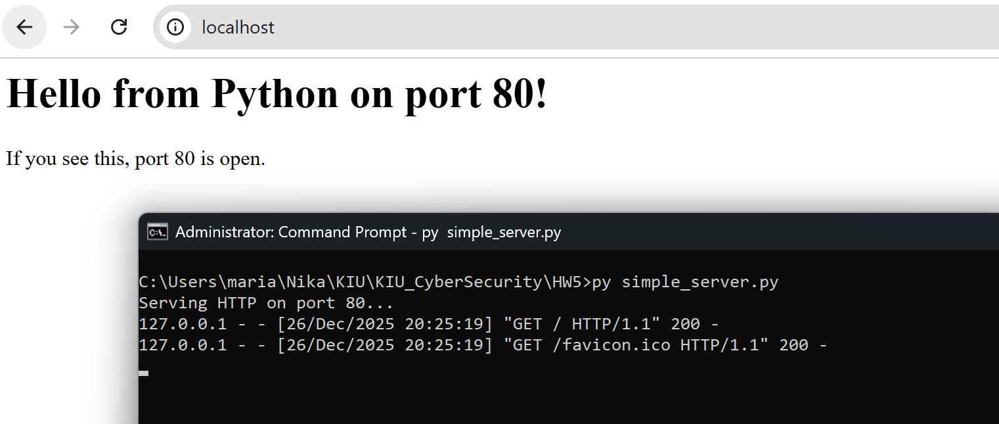
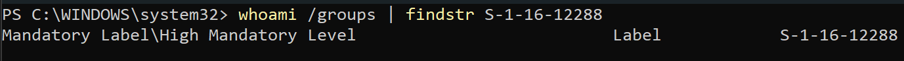
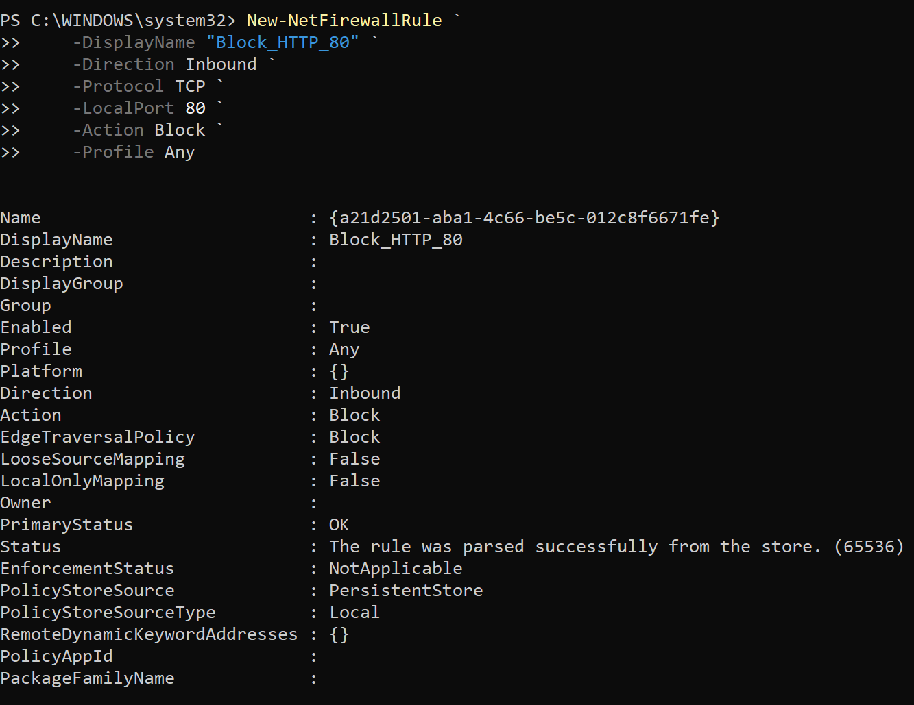
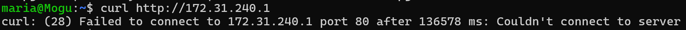
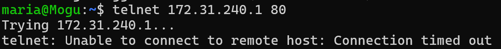
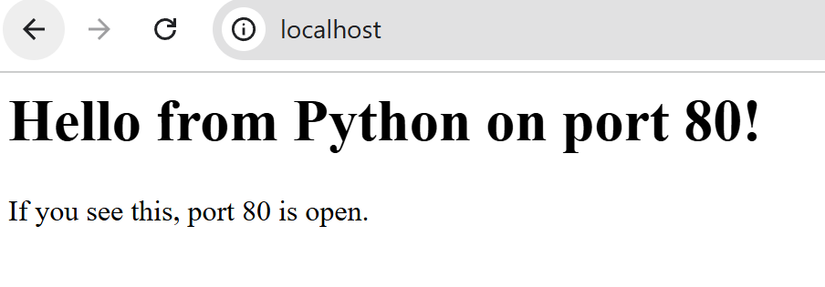
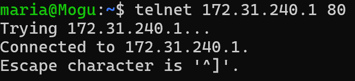

HW 5 of Cyber Security Course at KIU

We must 
0. Host app on `localhost:80`
1. Block incoming HTTP traffic to `localhost:80`
2. Test that it is blocked
3. Unblock

## 0. Hosting App On localhost:80
We write a simple python server script (visible at `simple_server.py` and run it to host on `localhost:80`)



## 1. Block Incoming Traffic on Port 80 (HTTP)
First we run powershell as administrator and verify that our access is elevated


We then create the blocking rule with
``` powershell
New-NetFirewallRule `
    -DisplayName "Block_HTTP_80" `
    -Direction Inbound `
    -Protocol TCP `
    -LocalPort 80 `
    -Action Block `
    -Profile Any
```

and get


## 2. Test That It Is Blocked
We enter WSL and first type `ip route | grep default` and get our device IP for WSL to connect to.
Here we got `172.31.240.1`

### Test With curl


### Test With telnet


### Test With Browser
Unlike Linux, Windows does not block local requests even in the presence of a firewall rule, so from local we are actually still allowed to go to `http://localhost:80`


## 3. Remove Firewall Rule
In powershell (in administrator mode) we type
`Disable-NetFirewallRule -DisplayName "Block_HTTP_80"`

To check that this worked:
### Test With telnet

