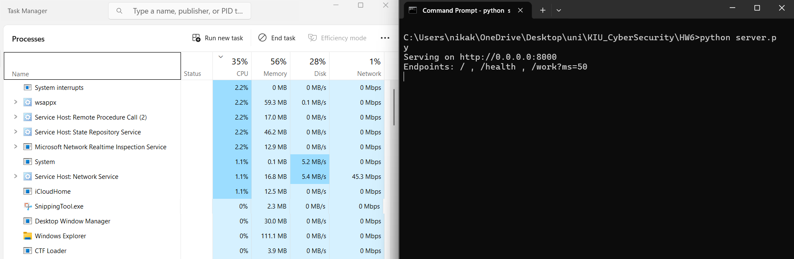

Performing Denial of Service attack on a local computer

Setup:
I use 2 computers (A and B) on the same network.
A spins up a server.
B floods it to take it down.

We observe the status of computer A through task manager and we also try to pass a legitimate request to this server from device C on this same network to confirm that the service is indeed denied.

First let's check that we can connect to this server.

IP of machine A is `192.168.100.7`

We check that machine B connects to it just fine

Baseline situation:

