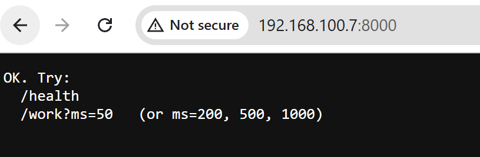

Performing Denial of Service attack on a local computer

## Setup
I use 2 computers (A and B) on the same network.
A spins up a server.
B floods it to take it down.

We observe the status of computer A through task manager and we also try to pass a legitimate request to this server from device C on this same network to confirm that the service is indeed denied.

First let's check that we can connect to this server.

IP of machine A is `192.168.100.7`

We check that machine B connects to it just fine

## Attack
### SYN Flood
We will use `hping3` to cause a SYN flood (send handshake request and then don't acknowledge it, many times in a row, to overwhelm the server's ability to receive new requests).

Tried this from inside WSL on machine A targeting machine B.
Embarassingly, this overwhelmed the attacker without affecting machine B.

Possible reasons:
1. (Most Likely) Windows Defender stopped SYN flood
2. Maybe machine A just can't make a strong SYN flood? Unlikely but possible

### SYN flood again but locally
Now let's try on local